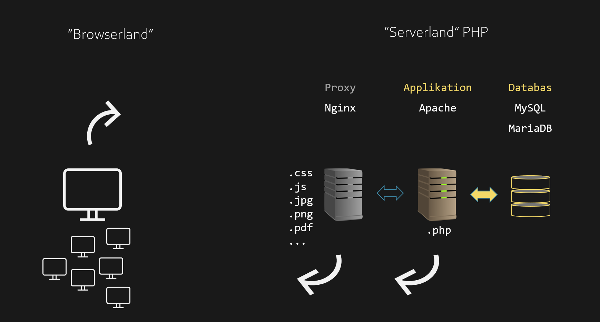
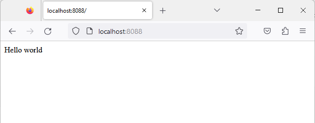
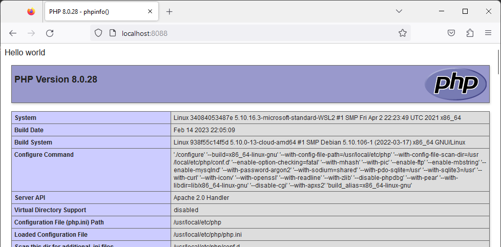
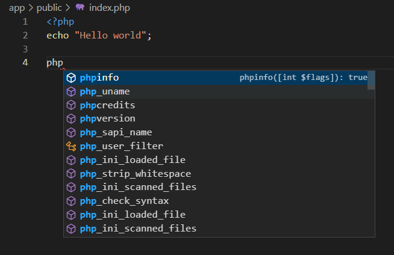
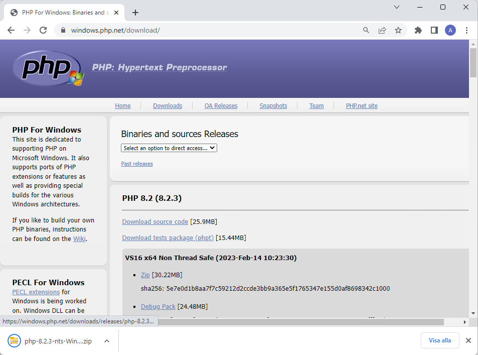
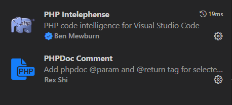
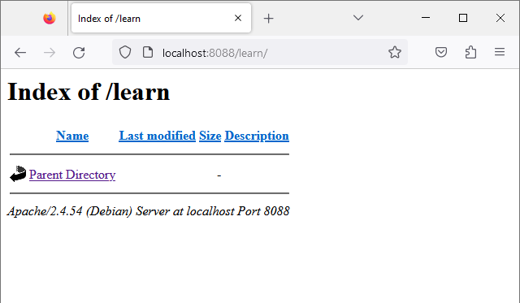

# Docker-PHP-lab

En introduktion till att börja koda PHP (Apache) i en Docker container. 

I PHP finns olika webbservrar, bland annat Apache och Nginx. De har olika fördelar och nackdelar. Nginx har blivit ett allt vanligare alternativ för en server installation, inte minst för att den kan hantera många anrop och därmed passar för trafikintensiva webbplatser. Apache har varit den server som de flesta webhotell erbjuder i sitt standardutbud, bland annat för att den använder en fil `.htaccess` där bland annat rättigheter kan sättas i en filstruktur. Apache hanterar servermiljön för dynamiska applikationer bra, Ngninx hanterar trafik bra. 

En webbplats som använder Nginx som en proxy som i sin tur skickar anrop till en Apache är gångbart.



I den här guiden används endast Apache. 

# Docker miljö
Dockerprojektet har följande filstruktur:

```markdown
.
├── app
│   ├── public
│       └── index.php
├── configs
│   ├── custom-apache2.conf
│   └── custom-php.ini
├── docker-compose.yml
├── Dockerfile

```

I filen `Dockerfile` kan version av PHP anges. I guiden används version 8.

```Dockerfile
# PHP version 7|8
# FROM php:7.4-apache
FROM php:8.0-apache
RUN a2enmod rewrite
RUN service apache2 restart
```

I filen `docker-compose.yml` anges att katalogen `app` pekar på Apaches förvalda struktur för en webbplats: `/var/www/html`.

I filen `docker-compose.yml` finns också möjligheten att ändra inställningar för php genom att redigera filen `custom-php.ini`. 

```yml
version: '3'
services:
    php-apache:
        build:
            context: .
            dockerfile: Dockerfile
        volumes:
            - ./app/public:/var/www/html
            - ./configs/custom-apache2.conf:/etc/apache2/apache2.conf
            - ./configs/custom-php.ini:/usr/local/etc/php/php.ini
        ports:
            - "8088:80"
```

Se till att Docker Desktop är igång och starta applikationen via terminalen med kommandot `docker-compose up`. Applikation kommer efter installation och uppstart att lyssna på port 8088.

Navigera med ern webbläsare till http://localhost:8088



I PHP finns en funktion som visar aktuell konfiguration - redigera filen `index.php` och lägg till funktionen `phpinfo();`

```php
<?php
echo "Hello world";

phpinfo();
```

Ladda om webbsidan så bör du se aktuella inställningar i php.



I Visual Studio Code finns stöd (intellisense) för syntax i PHP. 



Om du inte ser förslag på de olika metoder som finns i PHP kan du behöva ange sökvägen till en exekverbar fil - `php.exe`. Ett sätt att lösa det på är att ladda ner PHP från https://www.php.net/index.php. 





Packa upp filen, se till du placerar katalogstrukturen i din dator (i lämplig mapp) och peka därefter ut sökvägen i Visual Studio Code inställningar `settings`. I Windows kan det se ut så här:

```json
{
    "php.validate.enable": true,
    "php.validate.executablePath": "C:\\Service\\php-8.2.3-Win32-vs16-x64\\php.exe",
}
```


Extensions i Visual Sudio Code som kan vara användbara när du kodar PHP:



Nu bör du ha en fungerande miljö baserad på Visual Studio Code och en Docker container!

---

## Katalogstrukturer för en webbapplikation

Det finns olika tänkbara katalogstrukturer för en applikation. I det här exemplet är `app/public` en tänkt sökväg i en PHP hosting miljö för ex ett webbhotell. Det innehåll som placeras i den mappen är publikt.

```md
.
├── app
│   ├── public
│   │   └── index.php
 
```


Vissa servermiljöer ger tillgång till en högre hierarkisk nivå - katalogen `app`. Då kan vissa filer placeras i en struktur som applikationen har tillgång till, inte den som besöker webbplatsen i syfte att komma åt ex klasser eller moduler. Därmed kan den typen av filer placeras i `app/src`

```md
.
├── app
│   ├── public
│   │   └── index.php
│   ├── src
 
```

Filer som länkas in (ex stilmallar, bilder) kan placeras i mappen `public`. Ett vanligt katalognamn är assets.


```md
.
├── app
│   ├── public
│   │   ├── assets
│   │   │   ├── css
│   │   │   │    └── style.css
│   │   │   ├── images
│   │   │       └── logo.png
│   │   └── index.php
 
```


Ett CMS som Wordpress använder en struktur som möjliggör en enkel installation i hosting miljöer och hanterar unikt innehåll (som ex uppladdade filer) i separat katalog `wp-content`.

```md
.
├── wp-admin
├── wp-content
├── wp-includes
├── index.php
│── .htaccess
│── ... 
│── ... 
```

---

## Directory listing

En php-baserad webbserver visar förvalt filer med namnet index.php (eller index.html) om den filen finns i en mapp. En Apache server kan istället förvalt visa mappens innehåll, (vilket oftast inte är en bra funktion för en vanlig webbserver utan passar mer en filserver). I den här guiden ska vi använda PHP för att se olika möjligheter och därmed tillåter vi *directory listing* i en mapp med namnet `learn`. Skapa mappen `learn` i `public`, och skapa därefter fil en ny fil i mappen `learn` med filnamnet `.htaccess`.


```md
.
├── app
│   ├── public
│   │   ├── assets
│   │   │   ├── css
│   │   │   │    └── style.css
│   │   │   ├── images
│   │   │        └── logo.png
│   │   ├── learn
│   │   │   └── .htaccess
│   │   └── index.php
 
```

Ange följande direktiv i `.htaccess`

```php
Options +Indexes
```

Navigera till http://localhost:8088/learn/ så visas en tom lista.




Därmed är vi redo för att se mer hur man kodar PHP.